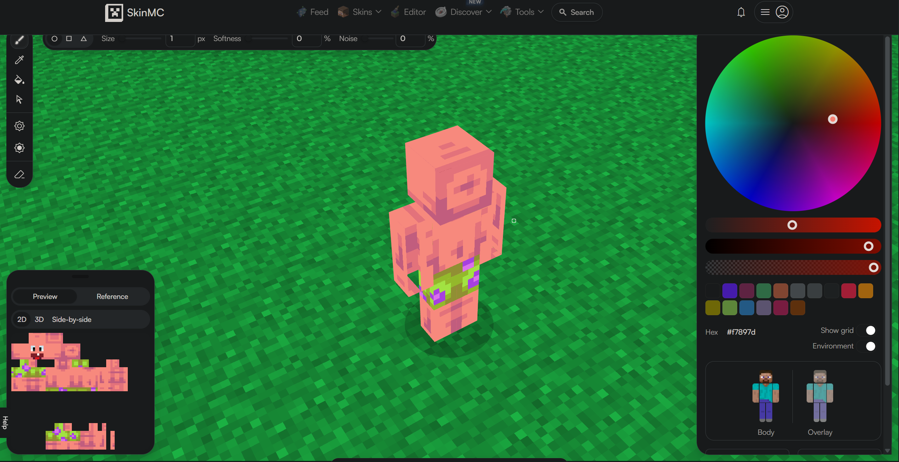

# LCE Skin Pack Manager -- NOT CURRENTLY FUNCTIONAL

## What this does

This is a skin pack manager to improve the ease of adding, creating, editing, and deleting skin packs in minecraft legacy for windows64

We won't support creating skins themselves

## How to convert a 64x64 skin into a legacy skin
Online converter: https://mcskins.top/x64-to-x32

Here is an example of viewing the converted legacy skin on https://skinmc.net/skin-editor

It's common for the texture to have missing pixels, so it's good to check and fill in

Redownloading the skin will turn it back into 64x64 and you will have to convert it back to legacy again

The texture shouldn't have any missing pixels after the second conversion

This is the only way we know of so far, so let us know in an issue if you have a better way

